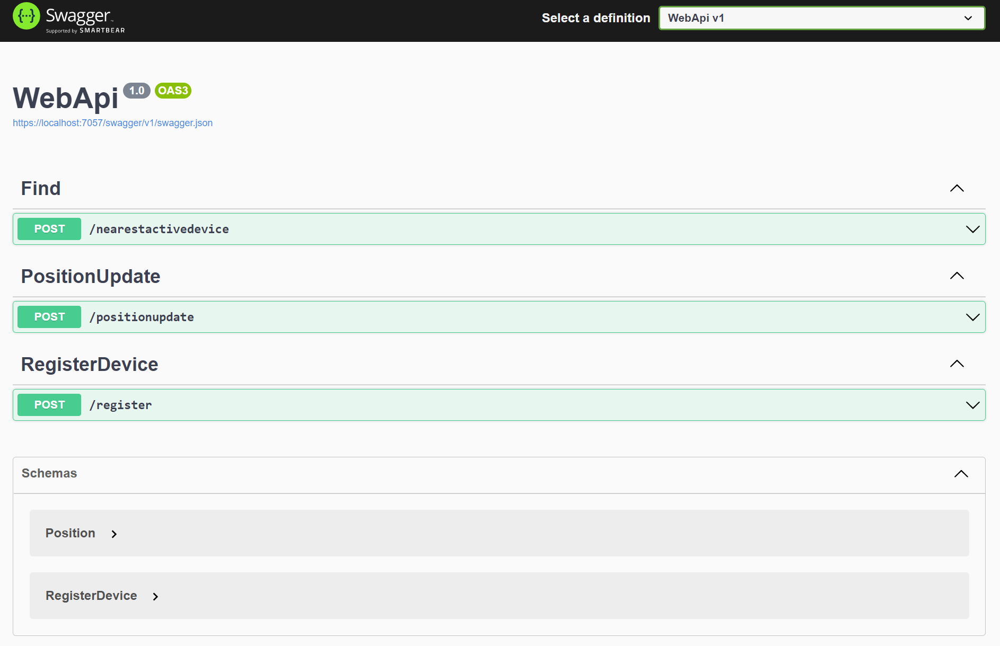

# Space Exploration Position Tracker 

As humanity begins to explore the universe around us, we need cooperation from everyone to make sure that humanity succeeds the transition from planetary to space faring civilization. 

The first step in doing so is colonizing Mars. We need tools that help us stay connected. This project serves this purpose.

This is a project that keeps track of various devices on Mars and helps people find those devices in case of need.

This is how the project achieves this:
 - A new device is registered by each company by making a <b>POST</b> request to <b>/api/registerdevice</b>
 - A unique key is returned for each registration request
 - Each device, uses this unique key to send location information by making another POST request to <b>/api/positionupdate</b>
 - Users can then send their location information using a POST request to <b>/api/find/nearestactivedevice</b> to find the nearest device which has sent a position update in the last 24 hours

---
 

# Swagger Document
 